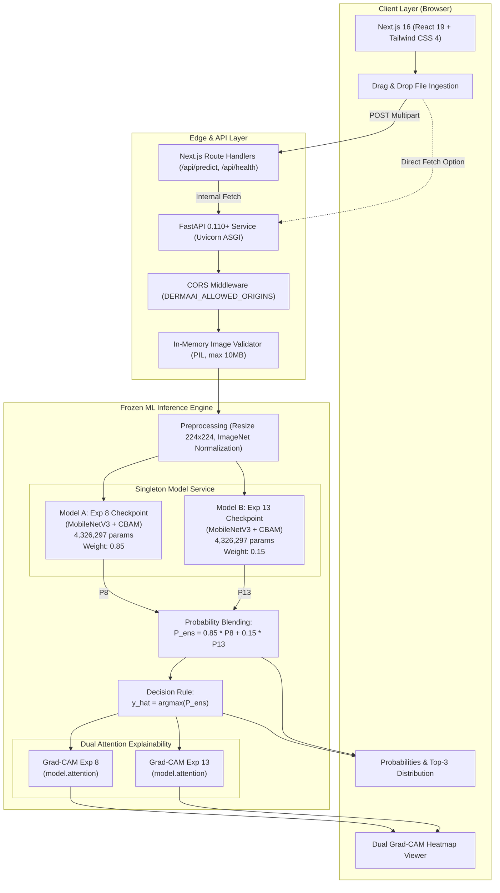
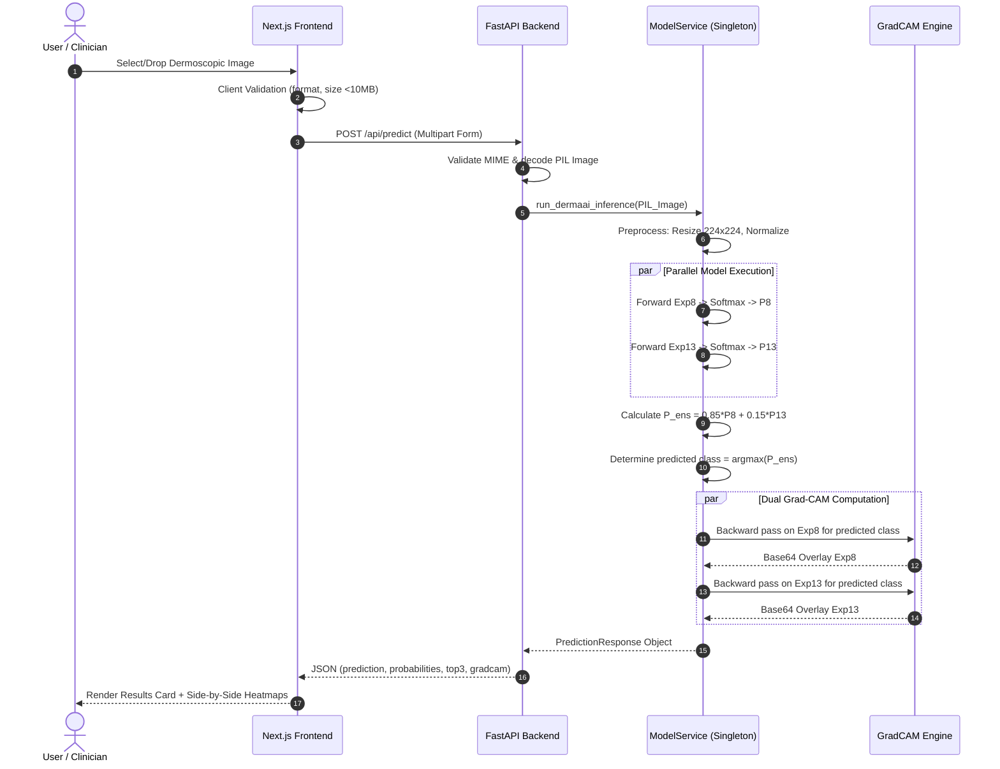

# DermaAI: System Architecture & Data Flow

This document details the architectural design, component responsibilities, data flow, and deployment topology of the **DermaAI** research demonstration platform.

---

## 1. High-Level System Architecture Diagram



---

## 2. Detailed Component Breakdown

### 2.1 Web Presentation Layer (Next.js 16)
- **Framework**: Next.js 16 with Turbopack, React 19, and Tailwind CSS 4.
- **Key Modules**:
  - `src/app/page.tsx`: Single-page reactive application orchestrating image upload, stage-based progress indicators, metric visualization, and Grad-CAM side-by-side display.
  - `src/components/layout/Navbar.tsx`: Header navigation with status badges and research context links.
  - `src/app/api/predict/route.ts` & `src/app/api/health/route.ts`: Resilient Next.js server route handlers providing automatic failover proxying to the FastAPI backend.

### 2.2 API & Serving Layer (FastAPI)
- **Framework**: FastAPI with Uvicorn ASGI server running on Python 3.11.
- **Port Management**: Dynamically honors `$PORT` environment variable (default: `8000`) for cloud PaaS (Render, Railway, Heroku).
- **CORS Management**: Configurable origins via `DERMAAI_ALLOWED_ORIGINS` (supports wildcard `*` or comma-separated lists).
- **In-Memory Safety**: Images are streamed directly to RAM via `BytesIO`, validated with Pillow, and discarded immediately after inference. Zero disk writes ensure compliance with privacy and data protection principles.

### 2.3 Frozen Model Inference Engine
- **Singleton Pattern**: `ModelService` loads both PyTorch checkpoints once during server startup into global memory.
- **Integrity Validation**: Verifies SHA-256 hashes (`ccc579cb...` for Exp 8, `9fab1b12...` for Exp 13) and parameter counts ($4,326,297$ each) before accepting traffic.
- **Strict Freezing**:
  - `model.eval()` invoked on both models.
  - All parameter tensors have `requires_grad = False`.
  - Zero weight updates, zero optimizers, zero training routines.

### 2.4 Mathematical Probability Blending
- **Forward Pass**:
  Given an input tensor $x \in \mathbb{R}^{1 \times 3 \times 224 \times 224}$:
  $$z_8 = f_{\theta_8}(x), \quad z_{13} = f_{\theta_{13}}(x)$$
  $$P_8 = \text{Softmax}(z_8), \quad P_{13} = \text{Softmax}(z_{13})$$
- **Ensemble Blend**:
  $$P_{\text{ens}} = 0.85 \cdot P_8 + 0.15 \cdot P_{13}$$
- **Argmax Decision**:
  $$\hat{c} = \arg\max_{j \in \{0 \dots 6\}} P_{\text{ens}}^j$$
  $$\text{Confidence} = P_{\text{ens}}^{\hat{c}}$$

### 2.5 Explainability Subsystem (Dual Grad-CAM)
- **Target Layer**: `model.attention` (the Convolutional Block Attention Module connecting the backbone feature extractor to the classification head).
- **Activation Volume**: $A \in \mathbb{R}^{1 \times 960 \times 7 \times 7}$.
- **Gradients**:
  $$\alpha_k = \frac{1}{7 \times 7} \sum_{i=1}^7 \sum_{j=1}^7 \frac{\partial z_{\hat{c}}}{\partial A_{k,i,j}}$$
- **Localization Map**:
  $$L_{\text{Grad-CAM}} = \text{ReLU}\left( \sum_{k=1}^{960} \alpha_k A_k \right)$$
- The resulting $7 \times 7$ saliency map is bilinearly upsampled to $224 \times 224$, normalized to $[0, 1]$, colorized with the OpenCV `COLORMAP_JET` palette, blended with the original lesion image at $\alpha=0.5$, and converted to base64 PNG for inline browser rendering.

---

## 3. Data Flow Sequence Diagram



---

## 4. Production Deployment Topology

```
                  ┌───────────────────────────────┐
                  │          Internet             │
                  └──────────────┬────────────────┘
                                 │ HTTPS (Port 443)
                                 ▼
                  ┌───────────────────────────────┐
                  │    Cloud Reverse Proxy /      │
                  │       CDN (Cloudflare)        │
                  └──────┬─────────────────┬──────┘
                         │                 │
           Host: app.dermaai.com           Host: api.dermaai.com
                         │                 │
                         ▼                 ▼
          ┌────────────────────────┐  ┌────────────────────────┐
          │   Next.js Front-end    │  │   FastAPI Back-end     │
          │     (Vercel/Render)    │  │ (Docker on Render/GCP) │
          │                        │  │                        │
          │ Node 20 Runtime        │  │ Python 3.11 Runtime    │
          │ Next.js 16 Turbopack   │  │ Uvicorn ASGI Server    │
          │ Next Route Handlers    │  │ In-Memory Model Cache  │
          └────────────────────────┘  └────────────────────────┘
```
